# Multi-Service Booking Platform

Sistema web de agendamentos para estabelecimentos de serviços como barbearias, salões de beleza, estúdios de tatuagens e
etc. Desenvolvido com Laravel 12, oferece controle completo de agendamentos, clientes, funcionários, promoções e
relatórios gerenciais.

---

## Screenshots

### Dashboard

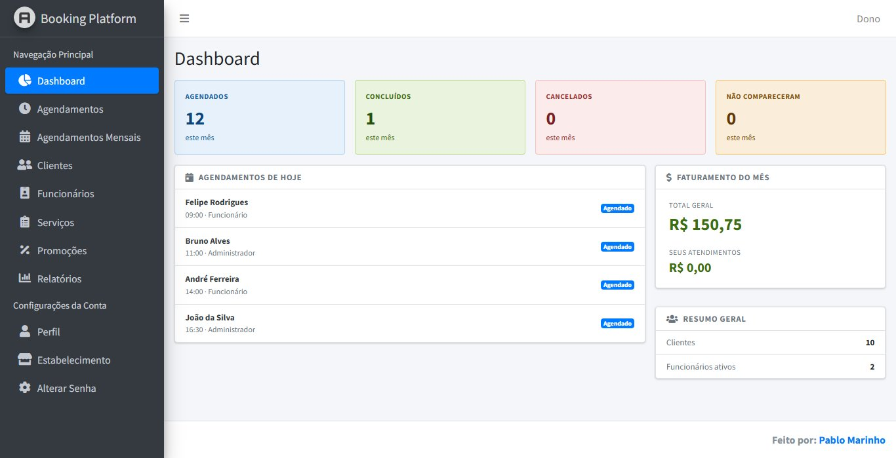

### Agendamentos

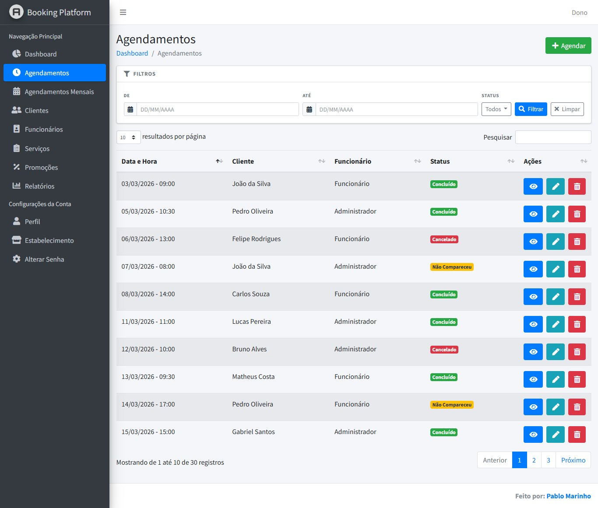

### Detalhe do Agendamento

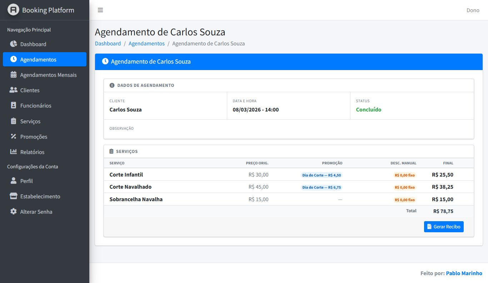

### Calendário Mensal

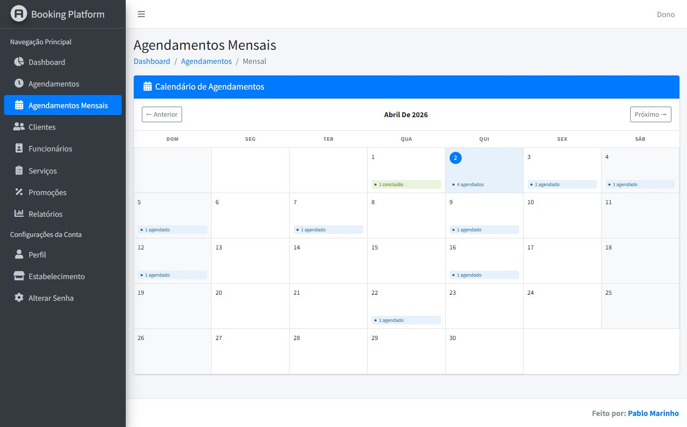

### Relatórios — Financeiro

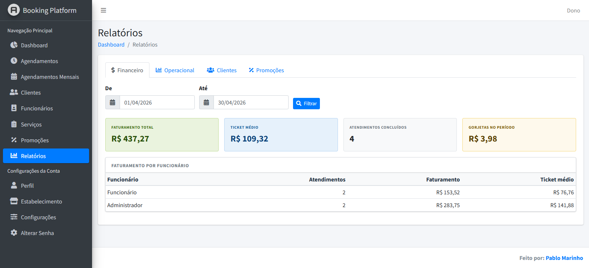

### Relatórios — Operacional

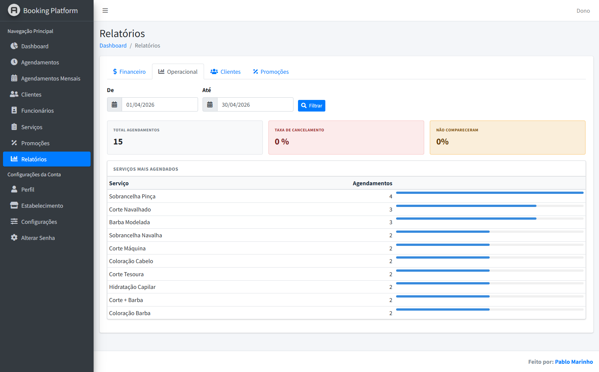

### Relatórios — Clientes

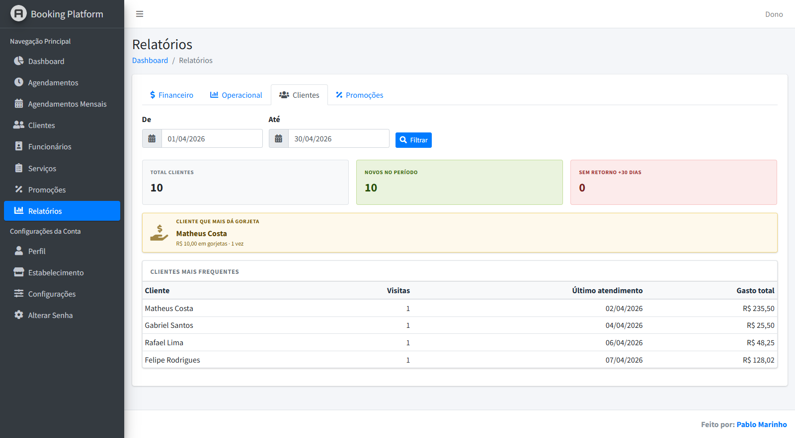

### Relatórios — Promoções

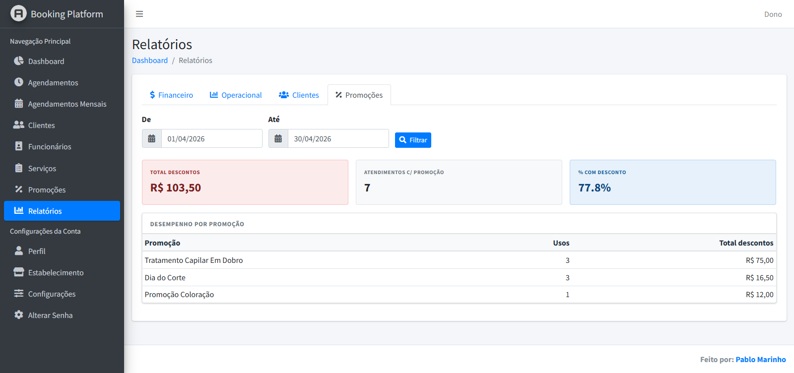

### Perfil do Usuário

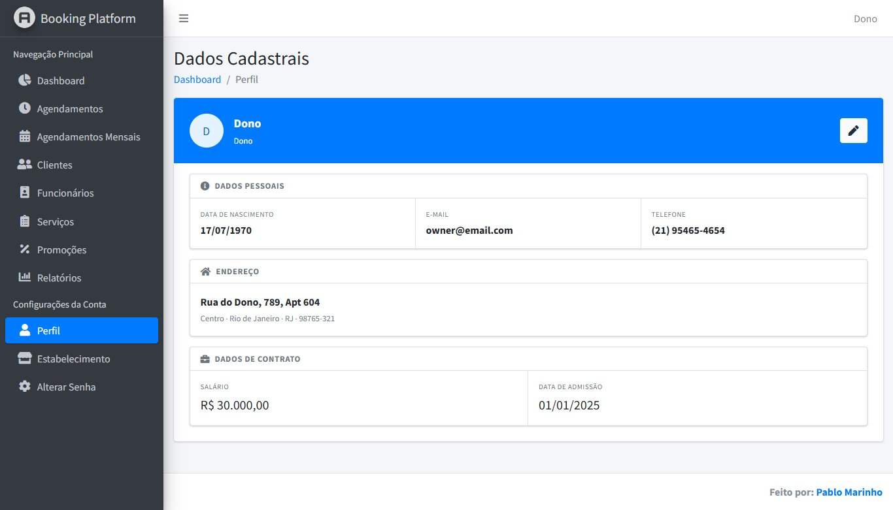

### Estabelecimento

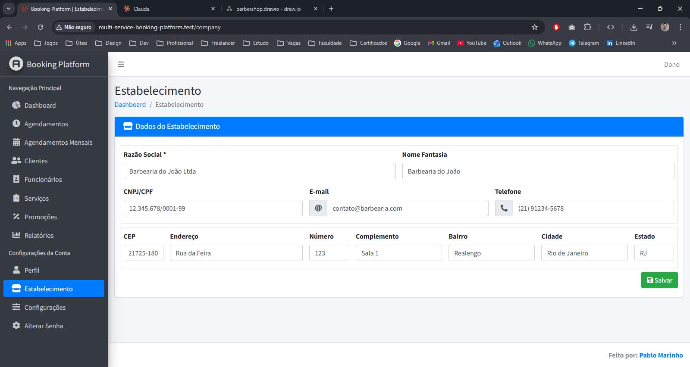

### Configurações

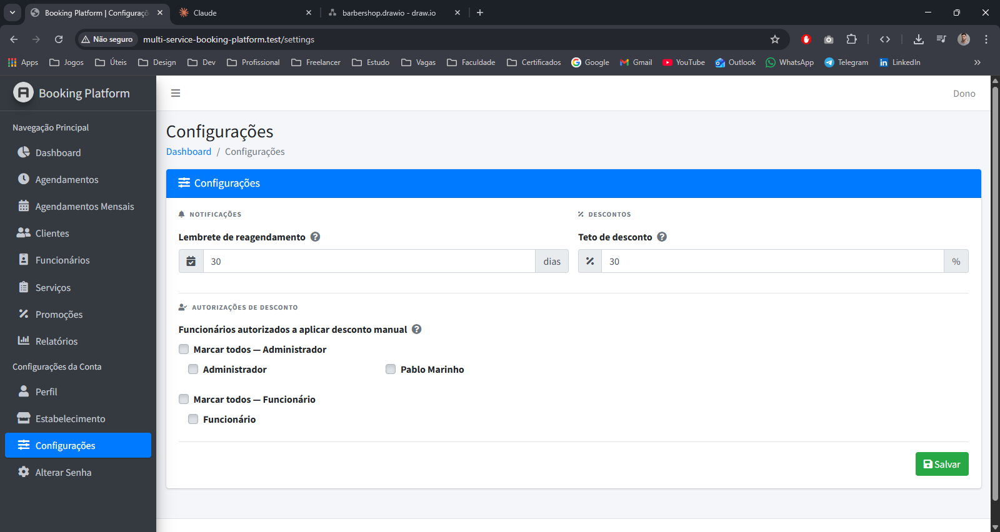

### Diagrama Entidade Relacionamento

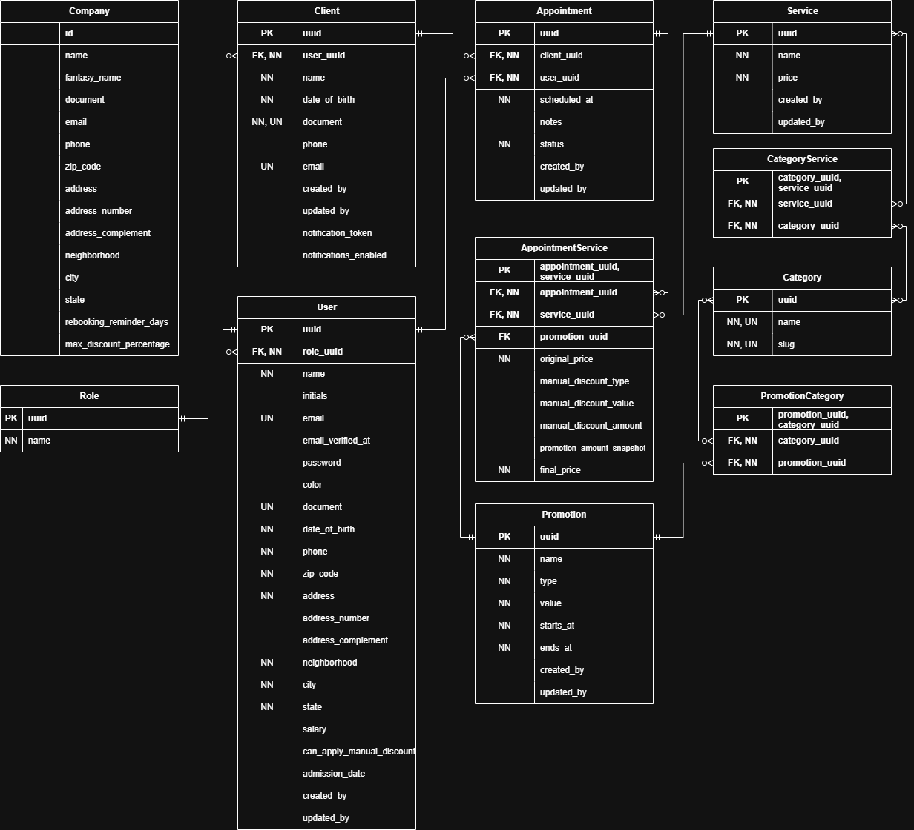

---

## Funcionalidades

- **Agendamentos** — criação, edição, cancelamento e conclusão de agendamentos com visualização em lista e calendário
  mensal
- **Serviços** — cadastro de serviços com categorias e preços
- **Clientes** — cadastro e gerenciamento de clientes com histórico de atendimentos
- **Funcionários** — controle de equipe com hierarquia de permissões (Proprietário, Administrador, Funcionário)
- **Promoções** — criação de promoções por categoria ou globais com aplicação automática nos agendamentos
- **Descontos** — suporte a desconto por promoção e desconto manual (fixo ou percentual) por serviço
- **Caixa** — fechamento de agendamentos com registro de pagamentos por múltiplas formas (dinheiro, débito, crédito, pix); gorjeta registrada automaticamente quando o cliente paga a mais; desconto no fechamento quando paga a menos, com exigência de autorização de administrador quando solicitado por funcionário
- **Recibo em PDF** — geração de recibo ao concluir um atendimento com detalhamento das formas de pagamento utilizadas
- **Dashboard** — visão geral do mês com faturamento, agendamentos do dia e resumo geral
- **Relatórios** — relatórios financeiros, operacionais, de clientes e de promoções com filtro por período; inclui total de gorjetas arrecadadas e destaque do cliente que mais gorjeta no histórico
- **Notificações** — envio automático de e-mail e SMS aos clientes ao cadastrar uma nova promoção, com opção de opt-out
- **Estabelecimento** — cadastro dos dados do estabelecimento utilizados nos recibos e notificações
- **Configurações** — personalização de comportamentos específicos do sistema

---

## Tecnologias

- **Backend:** PHP 8.4, Laravel 12
- **Frontend:** AdminLTE 3, Bootstrap 4, jQuery, DataTables, InputMask, Tempus Dominus
- **Banco de dados:** MySQL
- **Filas:** Laravel Queue com driver `database`
- **E-mail:** Resend
- **SMS:** Twilio
- **PDF:** Barryvdh DomPDF

---

## Requisitos

- PHP >= 8.4
- Composer
- MySQL
- Node.js (para assets)
- Conta no [Resend](https://resend.com) para envio de e-mails
- Conta no [Twilio](https://twilio.com) para envio de SMS

---

## Instalação

```bash
# Clone o repositório
git clone https://github.com/seu-usuario/multi-service-booking-platform.git
cd multi-service-booking-platform

# Instale as dependências PHP
composer install

# Copie o arquivo de ambiente
cp .env.example .env

# Gere a chave da aplicação
php artisan key:generate

# Configure o banco de dados no .env
DB_CONNECTION=mysql
DB_HOST=127.0.0.1
DB_PORT=3306
DB_DATABASE=db_booking
DB_USERNAME=root
DB_PASSWORD=

# Configure o e-mail (Resend)
MAIL_MAILER=resend
MAIL_FROM_ADDRESS=onboarding@resend.dev
MAIL_FROM_NAME="Booking Platform"
RESEND_API_KEY=re_xxxxxxxxxxxx

# Configure o SMS (Twilio)
TWILIO_SID=ACxxxxxxxxxxxx
TWILIO_TOKEN=xxxxxxxxxxxx
TWILIO_FROM=+1xxxxxxxxxx

# Configure a fila
QUEUE_CONNECTION=database

# Execute as migrations e seeds
php artisan migrate --seed
```

---

## Uso

```bash
# Inicie o servidor de desenvolvimento
php artisan serve

# Em outro terminal, inicie o worker de filas (necessário para notificações)
php artisan queue:work
```

Acesse `http://localhost:8000` e faça login com as credenciais do seed:

| Perfil        | E-mail             | Senha    |
|---------------|--------------------|----------|
| Proprietário  | owner@email.com    | Aa123456 |
| Administrador | admin@email.com    | Aa123456 |
| Funcionário   | employee@email.com | Aa123456 |

---

## Hierarquia de Permissões

| Funcionalidade  | Proprietário | Admin | Funcionário |
|-----------------|:------------:|:-----:|:-----------:|
| Dashboard       |      ✓       |   ✓   |      ✓      |
| Agendamentos    |      ✓       |   ✓   |      ✓      |
| Clientes        |      ✓       |   ✓   |      ✓      |
| Funcionários    |      ✓       |   ✓   |      —      |
| Serviços        |      ✓       |   ✓   |     Ver     |
| Promoções       |      ✓       |   —   |      —      |
| Relatórios      |      ✓       |   —   |      —      |
| Estabelecimento |      ✓       |   —   |      —      |
| Configurações   |      ✓       |   —   |      —      |

---

## Testes

```bash
php artisan test
```

Os testes cobrem controllers, policies e regras de validação para todas as entidades do sistema.

---

## Estrutura do Banco de Dados

| Tabela                 | Descrição                                      |
|------------------------|------------------------------------------------|
| `users`                | Usuários do sistema (dono, admin, funcionário) |
| `roles`                | Perfis de acesso                               |
| `clients`              | Clientes do estabelecimento                    |
| `appointments`         | Agendamentos                                   |
| `appointment_services` | Serviços vinculados a um agendamento           |
| `appointment_payments` | Pagamentos registrados no fechamento do caixa  |
| `services`             | Serviços oferecidos                            |
| `categories`           | Categorias de serviços                         |
| `promotions`           | Promoções com desconto fixo ou percentual      |
| `company`              | Dados do estabelecimento                       |

---

## Licença

Este projeto foi desenvolvido sob encomenda e é de uso proprietário.

---

## Contato

Desenvolvido por [Pablo Marinho](https://pablolucasmarinho.github.io/portfolio/)

- 📧 contatopablomarinho@gmail.com
- 📱 (21) 99157-1242
